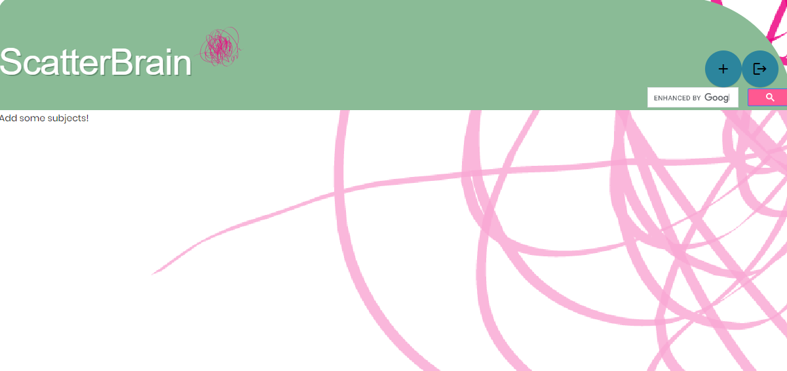
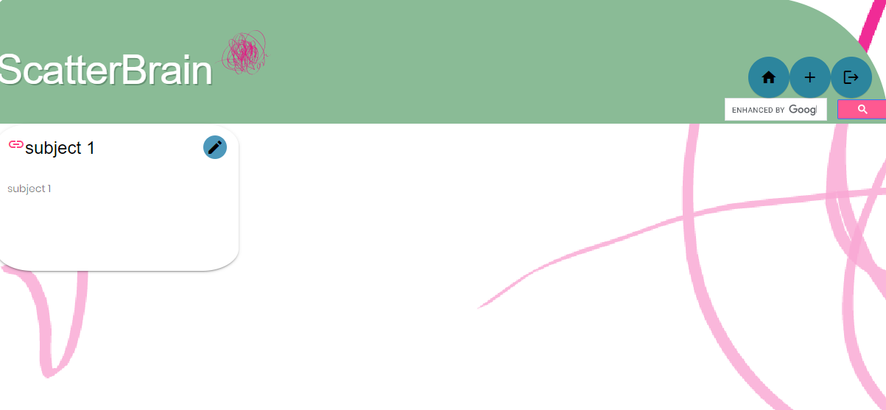

<h1 align="center">Scatterbrain</h1>

  

## Table of Contents
- [Description](#description)
- [Installation](#install)
- [Usage](#usage)
- [Questions](#questions)

## Description
### This application uses MySql2, nodemon, sequelize, dotenv, scss, and handlebars to create a user generated index of visited sites and the pertinent information found within. Keeping a detailed index of sites visited and the reason behind why it was searched in the first place will help the user keep better track of any projects or hobbies they might have that require a fair bit of research. 

## Screenshot of the webpage:
### Homepage lists subject tabs, each of which can contain a library of links and notes pertaining to a certain topic.

### The subject page loads when a specific topic is selected. Loading in the actual links and notes left by the user.

### All subjects and user notes can be added, edited, and deleted by the user.

## Usage
### Create a username and password, the PW must be at least six characters. Create a subject tab for your current area of research or interest. Fill that tabs library with any links and notes you might want to look at again.

## Install
npm init  --> npm install mysql2 sequelize dotenv handlebars

npm install nodemon "if you want an easier time testing while changing routes"

add JAWSDB in heroku and 'heroku restart' to inform the server to fill a DB that is no longer on your local machine. 

## Questions
## Contact us at:
### [CodyDiab](https://github.com/CodyDiab)
### [JCSRyan](https://github.com/jcsryan)
### emailcodydiab@gmail.com
### JohnConnorSRyan@gmail.com
